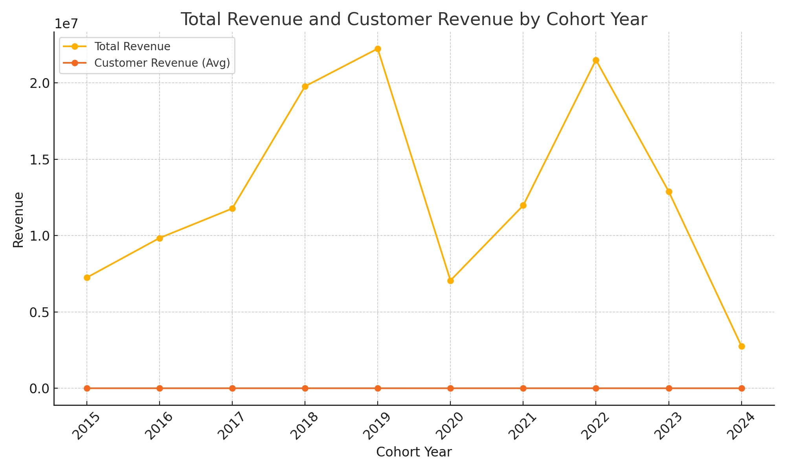
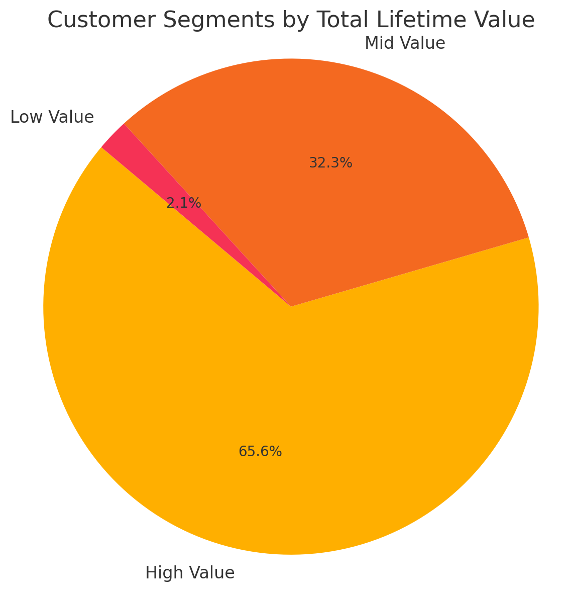
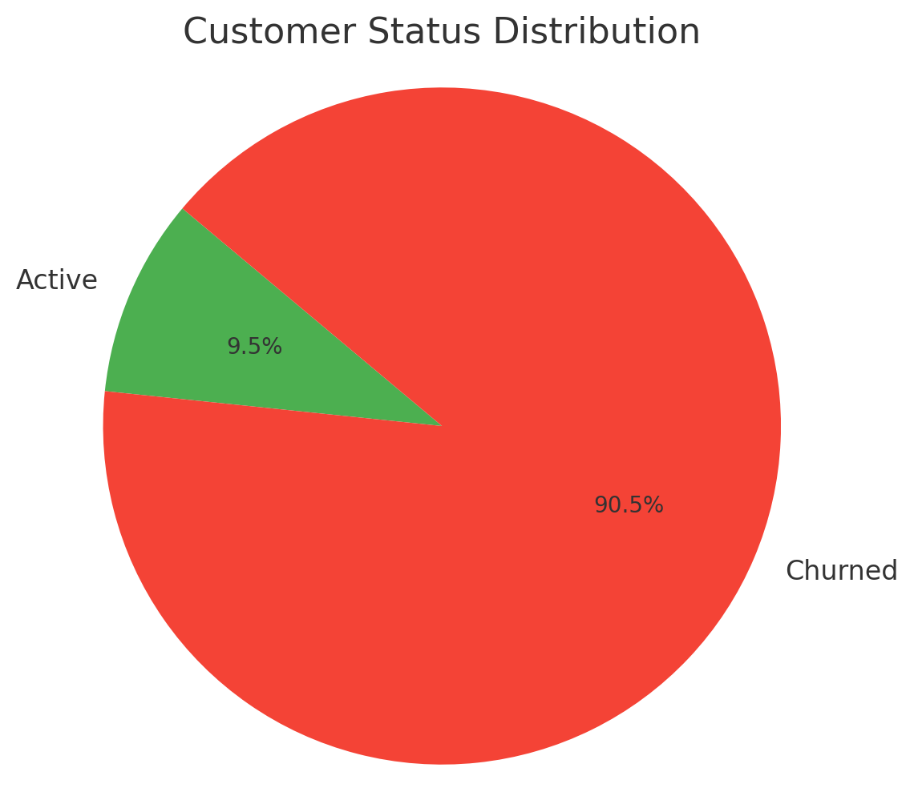
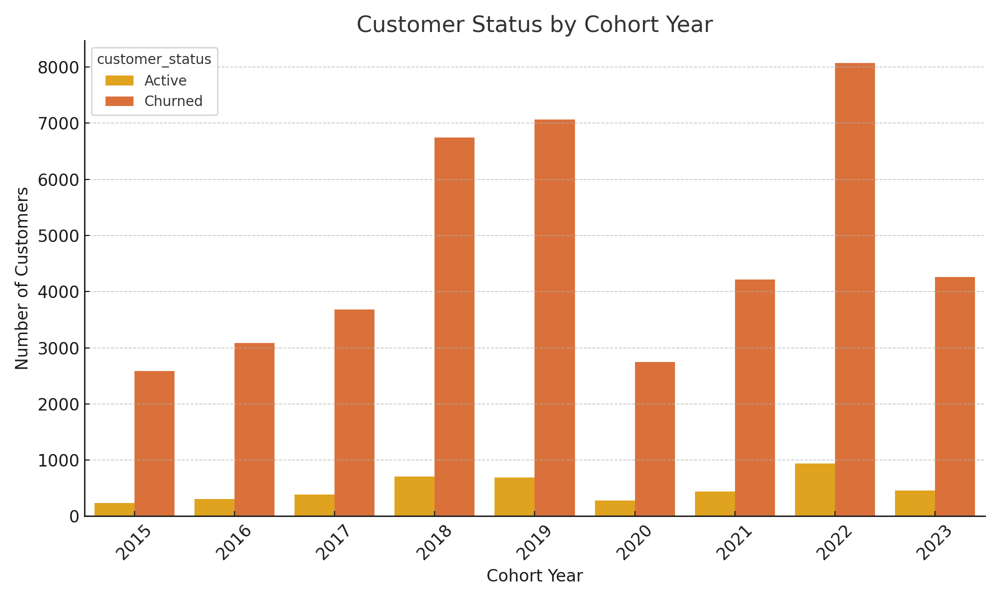

# Intermediate SQL - Sales Analysis

## Questions

**1. Cohort Analysis:** How do different customer groups generate revenue?

**Query:** [1_cohort_analysis.sql](/views/1_cohort_analysis.sql)

**Visualization:**  

---

**2. Customer Segmentation:** Who are our most valuable customers?

**Query:** [2_customer_segmentation.sql](/views/2_customer_segmentation.sql)

**Visualization:**  

---

**3. Retention Analysis:** Classify customers as Active vs. Churned

**Query:** [2_retention_analysis.sql](/views/2_retention_analysis.sql)

**Visualization:**  
Customer Status Distribution  

Total customer retention and churn by cohort year  

